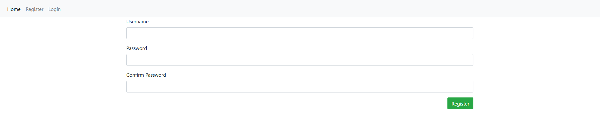
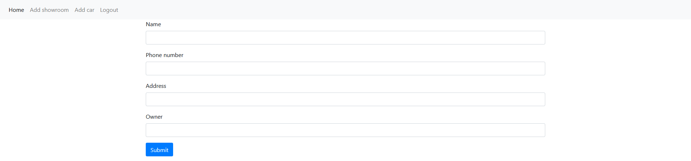
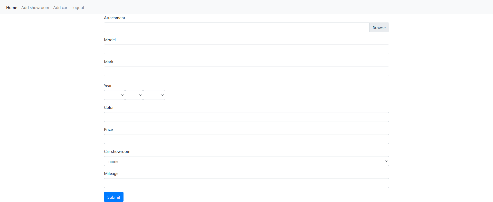
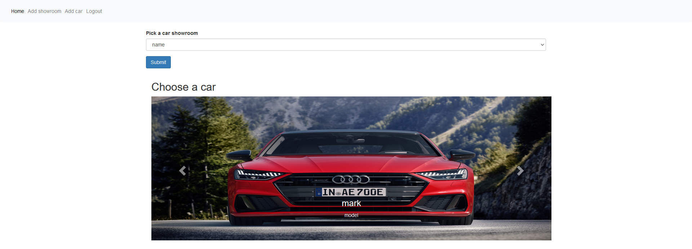
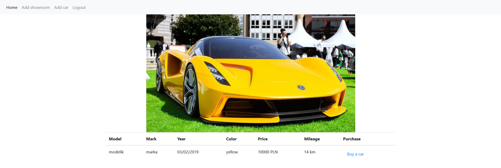
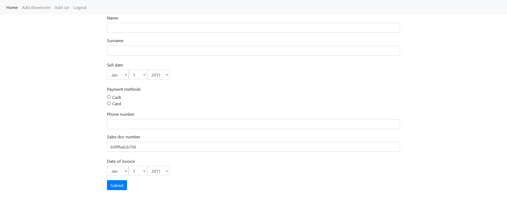

Aplikacja jest projektem stworzonym podczas odbywania praktyk w celu nauki 
i zrozumienia jezyka PHP oraz frameworka Symfony.

Aplikacja zawiera prosty system rejestracji wraz z ukrywaniem pewnych elementów
użytkownikom niezalogowanym na konta administratorskie.

Będąc zalogowanym mamy możliwość dodania salonu samochodowego wypełniając formularz.

Gdy stworzymy już salon możemy przejść do menu dodania auta i wybierając odpowiedni
salon tworzymy dla niego auto.

Na stronie głównej mamy możliwość wybrania interesującego nas salonu aby zobaczyć
dostępne w nim auta.

Po kliknięciu w zdjęcie auta zostaniemy przekierowani do podstrony prezentującej
jego szczegóły. Z tego miejsca mamy możliwość dokonania zakupu. Jeśli auto widnieje
w bazie jako dostępne pojawi się nam link kierujący nas do formularza zakupu.

Strona prezentuje nam prosty formularz zakupu. Należy wypełnić go danymi użytkownika.
Część danych jak username czy cena auta zostają pobrane automatycznie z odpowiednich
danych. Po dokonaniu zakupu nie można przejść do zakładki zakupu dla danego auta.

